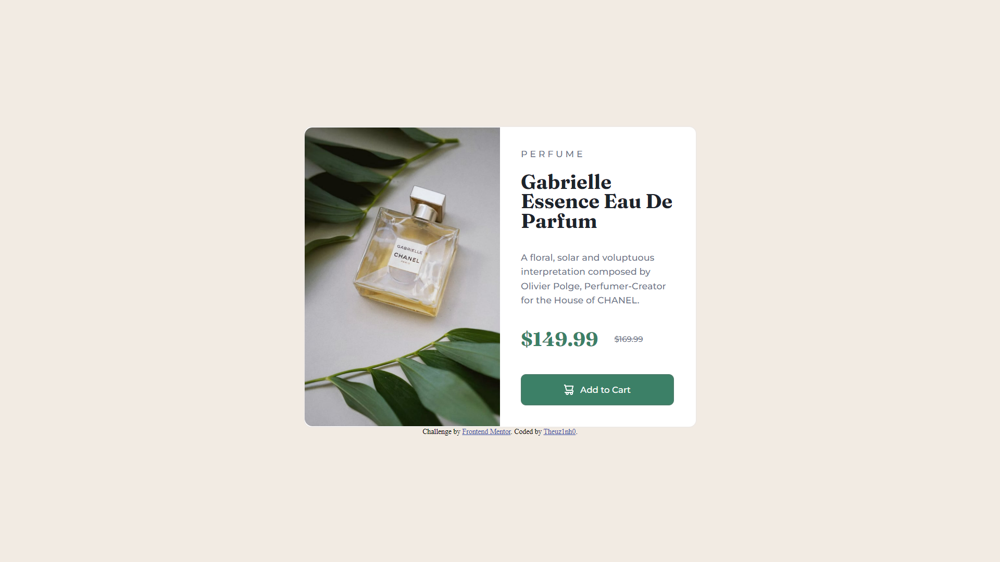

## Table of contents

- [Overview](#overview)
  - [The challenge](#the-challenge)
  - [Screenshot](#screenshot)
  - [Links](#links)
- [My process](#my-process)
  - [Built with](#built-with)
  - [What I learned](#what-i-learned)
  - [Continued development](#continued-development)
  - [Useful resources](#useful-resources)
- [Author](#author)

**Note: Delete this note and update the table of contents based on what sections you keep.**

## Overview

### The challenge

Users should be able to:

- View the optimal layout depending on their device's screen size
- See hover and focus states for interactive elements

### Screenshot



### Links

- Solution URL: [Solution URL here](https://github.com/Theuz1nh0/Frontend-Mentor-Product-preview-card-component)
- Live Site URL: [Live site URL here](https://theuz1nh0.github.io/Frontend-Mentor-Product-preview-card-component/)

## My process

### Built with

- Semantic HTML5 markup
- Flexbox

### What I learned

```css
@import url('https://fonts.googleapis.com/css2?family=Fraunces:opsz,wght@9..144,100;9..144,400;9..144,500;9..144,700&family=Montserrat:wght@100;500;700&display=swap');
```
```css
body {
  align-items: center;
  background-color: #f2ebe3;
  display: flex;
  flex-direction: column;
  justify-content: center;
  min-height: 100vh;
}
```

### Continued development

I intend to continue studying about responsive web design and flexbox, as well as delving deeper into html and css

### Useful resources

- [Text fonts](https://fonts.google.com/) - This helped me put the necessary fonts for my project.
- [Flexbox](https://css-tricks.com/snippets/css/a-guide-to-flexbox/) - This helped me to position my html elements in a practical and fast way. Recommend if you want to learn a little about flexbox.

## Author

- Frontend Mentor - [@Theuz1nh0](https://www.frontendmentor.io/profile/Theuz1nh0)
- Instagram - [@mateus_moura_01](https://www.instagram.com/mateus_moura_01/)